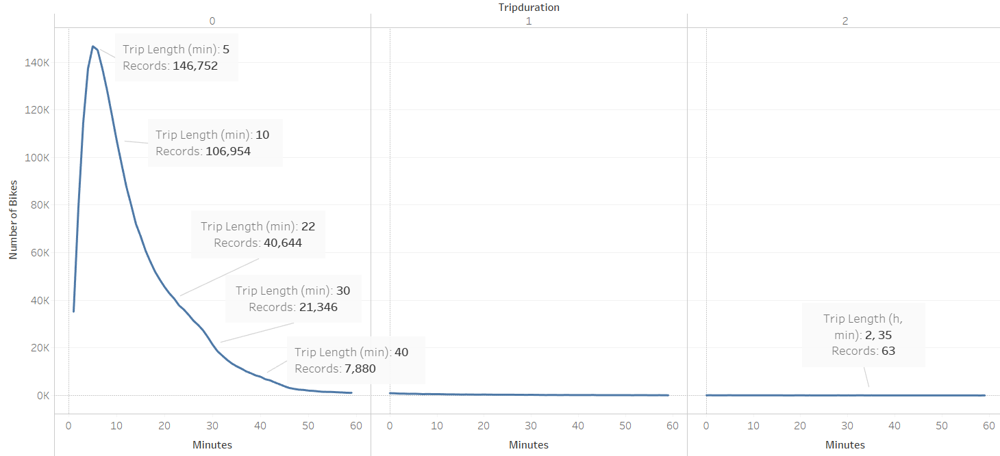
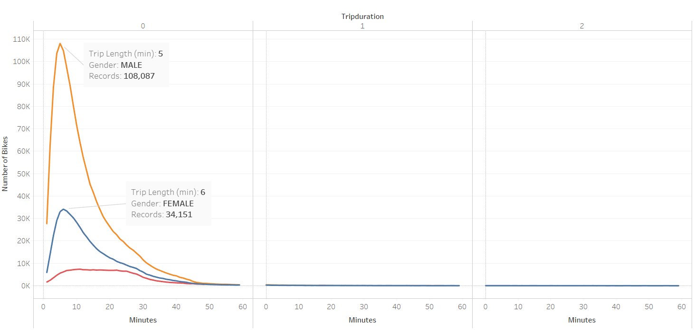
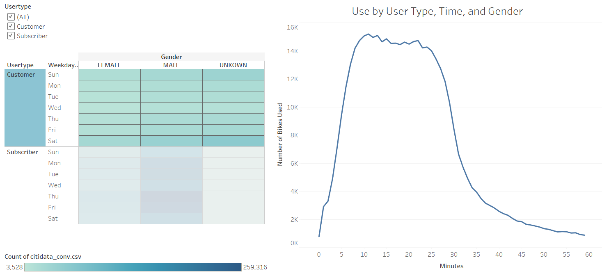

# Citibike_Analysis

After acquiring use statistics for the Citibike NYC product, our client wants to parse through the data and determine the viability of the same product in Des Moines. With the help of Tableu, let's take a look at trends evident in the data. Follow the link below for the interactive story of findings, or take note of the figures in each section.

[link to dashboard](https://public.tableau.com/profile/david8508#!/vizhome/citiBike_report/Story1?publish=yes "link to Tableau dashboard") 

## Typical Usage in NYC
Citibike is especially viable in New York for two primary reasons: destination saturation and pedestrian-centric structure. Citibike users are typically able to reach their destinations in less than 20 minutes, a product of the proximity of bike hubs to a myriad of locations and experiences aided by the accessibility of bikers to the thoroughfares of New York. 

That said, the primary use of Citibikes comes from men, with nearly 4 times as many male users as female.

Despite the overall skew in gender use, both genders have the same usage trends, with commute times yielding the most trips regardless of gender.

As a former resident, this chart is congruous with the apparent bike population throughout the city. Commute hours yield high bike congestion due to the population that wishes to dodge the subway, stay health-conscious, or simply enjoy the sights and sounds of the city. Similarly, Saturday shows a spike of usage from residents and tourists alike, as does Sunday after the typical brunch hours.

### Non-resident speculation
Speaking of tourists, "customers" of the Citibike program denote users who do not own a subscription to the service. I speculate the primary "customers" of the program have no need for a subscription as they are more than likely not able to access the program on a regular basis, hence, tourists. Since tourism is certainly one of the leading industries of the city, Citibike "customers" have a not insignificant portion of the use of the program as a whole, albeit just below a 10% slice of the rides at any time.

While dwarfed in comparison to resident rides, customer accounts are activated at a higher cost to the user, and can therefore lead to greater profitability of the service as a whole.

## Transposition to Des Moines
While the Citibike program is certainly a hallmark of New York travel, transposition to a new location must be predicated on the pedestrian-friendly nature of the new market. While I am not personally familiar with Des Moines' walkability, strategic placement of the bike hubs in commuter pockets could certainly yield similar usage trends as that of New York.

